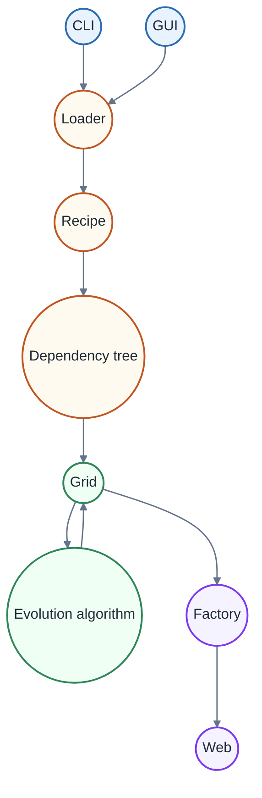

# Factory creator

```{toctree}
:caption: Rozcestí
:maxdepth: 1
:titlesonly:

user_interface
loader
core
output
historic_todo
```

Projekt můžeme rozdělit do 4 hlavních částí, které jsou zobrazeny na
následujícím diagramu:



První část zahrnuje vstupní rozhraní, které může být buď příkazový řádek (CLI)
nebo grafické uživatelské rozhraní (GUI). Tyto komponenty slouží k načtení
receptu a jeho předání do další části systému, kterou je Loader. Více o tom, jak
Uživatelské rozhraní funguje, je možné se dočíst v
[uživatelské dokumentaci](../user_docs/index.md) či
[technické dokumentaci pro Uživatelské rozhraní](user_interface.md).

**Loader** je zodpovědný za načtení receptu a převedení jeho obsahu do stromu
závislostí, který je následně předán do další části systému, kterou je Grid.
Více o tom, jak Loader funguje, je možné se dočíst v
[technické dokumentaci pro Loader](loader.md).

Další částí projektu je **Core** část, která zahruje práci s maticí/gridem/2D
polem, které repreztuje továrnu, a evoluční algoritmus, který je zodpovědný za
optimalizaci továrny. Více o tom, jak Core část funguje, je možné se dočíst v
[technické dokumentaci pro Core](core.md).

Poslední částí projektu je output část, která zahrnuje transformaci interní
gridové reprezentace továrny do webově přívětivého JSON formátu a jeho následné
zobrazní v embeded prohlížeci. Více o tom, jak output část funguje, je možné se
dočíst v [technické dokumentaci pro Output](output.md).

Mimo příslušné technické dokumentace pro jednotlivé části projektu, je u každé
třídy a jejich metod přítomné i in code dokumentace.
